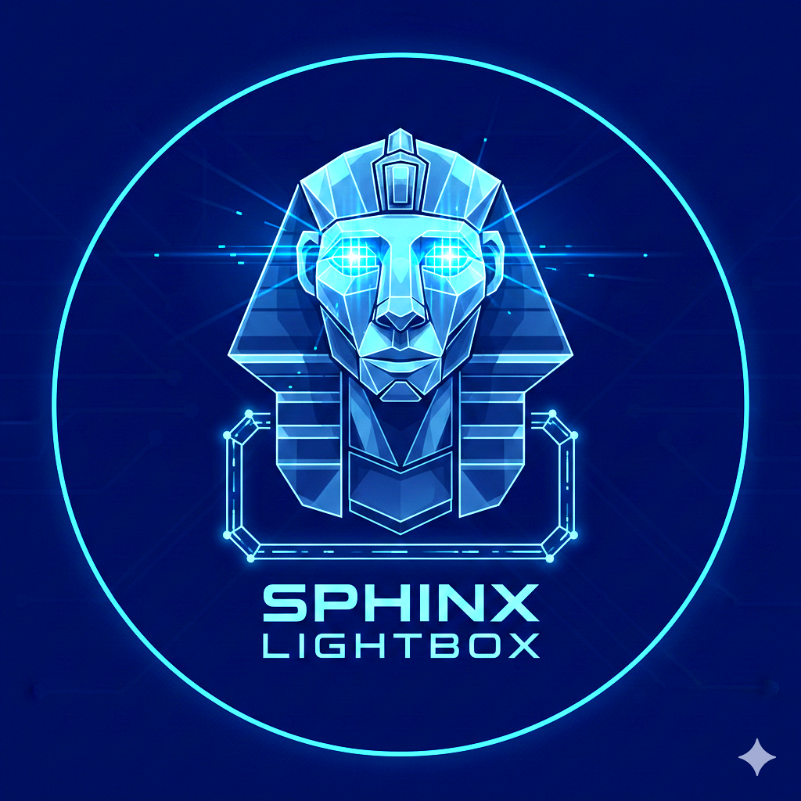
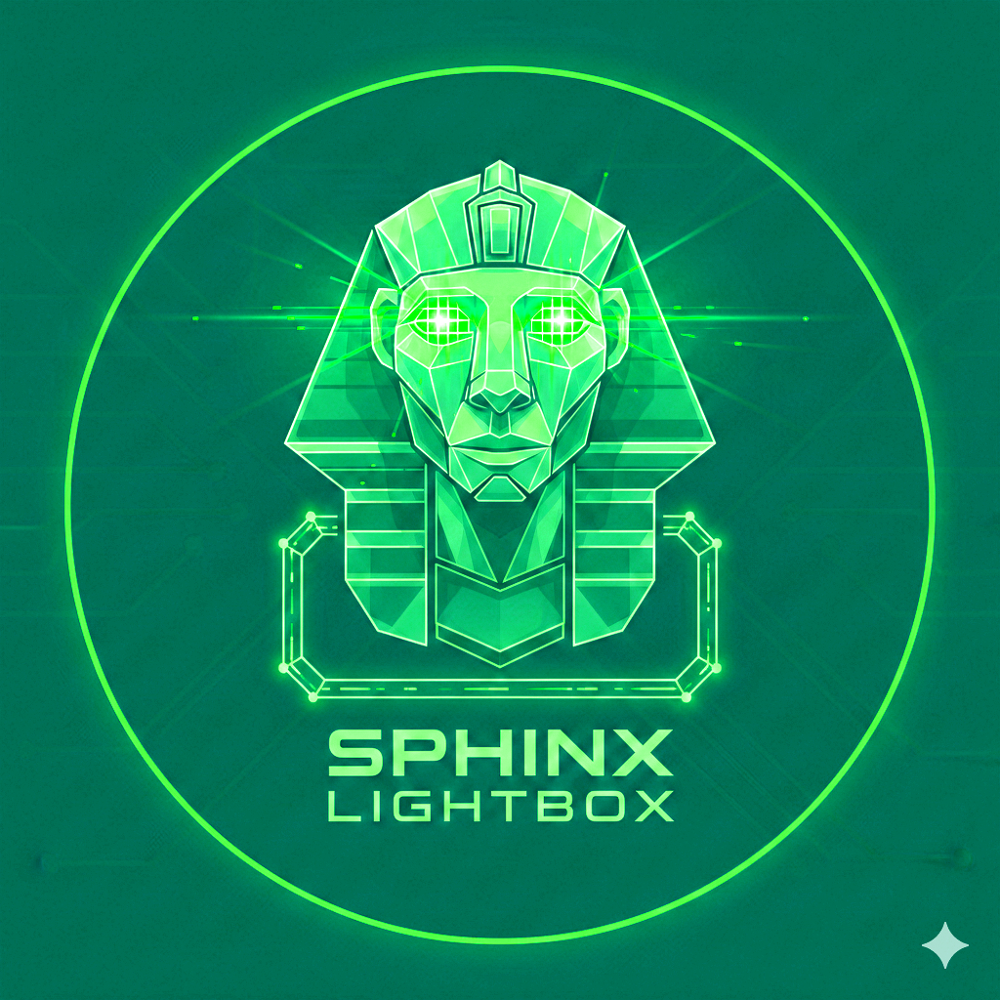

.. meta::
   :description: sphinx-lightbox — accessible click-to-enlarge images for Sphinx documentation.
   :keywords: sphinx, extension, lightbox, image, zoom, accessible

==================================
sphinx-lightbox Documentation
==================================

**Version:** |release|

.. rubric:: Accessible click-to-enlarge images for Sphinx.

``sphinx-lightbox`` is a Sphinx extension that provides click-to-enlarge image
viewing in HTML output using a CSS-driven checkbox-toggle mechanism, progressively
enhanced with lightweight JavaScript for keyboard activation, focus management,
and gallery navigation.

.. only:: html

   You can also download this documentation as a
   :download:`PDF file <_downloads/sphinx-lightbox.pdf>`.

.. note::

   This documentation is *self-referential*: the live examples below are
   rendered by the extension you are reading about.

Project Homes
-------------

- `GitHub repository <https://github.com/aputtu/sphinx-lightbox>`_
- `PyPI package <https://pypi.org/project/sphinx-lightbox/>`_

Image Example
-------------

.. only:: html

   Click the images below to see explicit lightbox handling for normal Sphinx
   ``image`` directives. Use the previous and next controls, or the arrow
   keys, to move through the gallery. Close the lightbox with the close icon,
   by clicking outside the image, or with ``Esc``, ``Enter``, or ``Space``.

.. only:: latex

   In the HTML documentation, users are told to click these standard Sphinx
   ``image`` examples to open them in a lightbox. Because this page contains
   multiple lightbox images, web users can also move between them with gallery
   controls or the arrow keys. They can close the lightbox with the close
   icon, by clicking outside the image, or with ``Esc``, ``Enter``, or
   ``Space``.

Figure Example
--------------

.. only:: html

   Click the figure below to see the built-in figure caption and legend copied
   into the lightbox overlay. Close the lightbox with the close icon, by
   clicking outside the image, or with ``Esc``, ``Enter``, or ``Space``.

.. only:: latex

   In the HTML documentation, users are told to click this standard Sphinx
   ``figure`` example to open it in a lightbox. The web overlay shows the
   image together with the figure caption and legend text. They can close the
   lightbox with the close icon, by clicking outside the image, or with
   ``Esc``, ``Enter``, or ``Space``.

   Figure caption shown on the page and in the lightbox overlay.

   This legend is longer explanatory text attached to the figure. It remains
   on the page and is also shown in the lightbox overlay.

Key Features
------------

- **CSS-Driven Toggle** — uses a highly robust checkbox-toggle pattern at its core, 
  progressively enhanced with lightweight JavaScript for keyboard accessibility.
- **Sphinx-native image handling** — images are registered with Sphinx's
  collector, land in ``_images/``, and participate in incremental builds.
- **Multi-builder support** — full lightbox in HTML, ``\includegraphics``
  with caption in LaTeX/PDF, plain image fallback in other builders.
- **Accessibility-conscious design** — visible focus indicators, ``role="dialog"``,
  ``aria-modal``, accessible control text, ``prefers-reduced-motion``, focus
  management, and ``prefers-contrast: more`` support.
- **Proper node architecture** — custom docutils nodes with per-builder
  visitor functions, following Sphinx extension best practices.
- **GPL-3.0-or-later** licensed open source.

Contents
--------

.. toctree::
   :maxdepth: 2
   :caption: User Guide

   installation
   usage
   accessibility

.. toctree::
   :maxdepth: 2
   :caption: Reference

   directive
   api

.. toctree::
   :maxdepth: 1
   :caption: Project

   changelog
   development
   release-checklist
   license

Indices and tables
------------------

* :ref:`genindex`
* :ref:`search`
